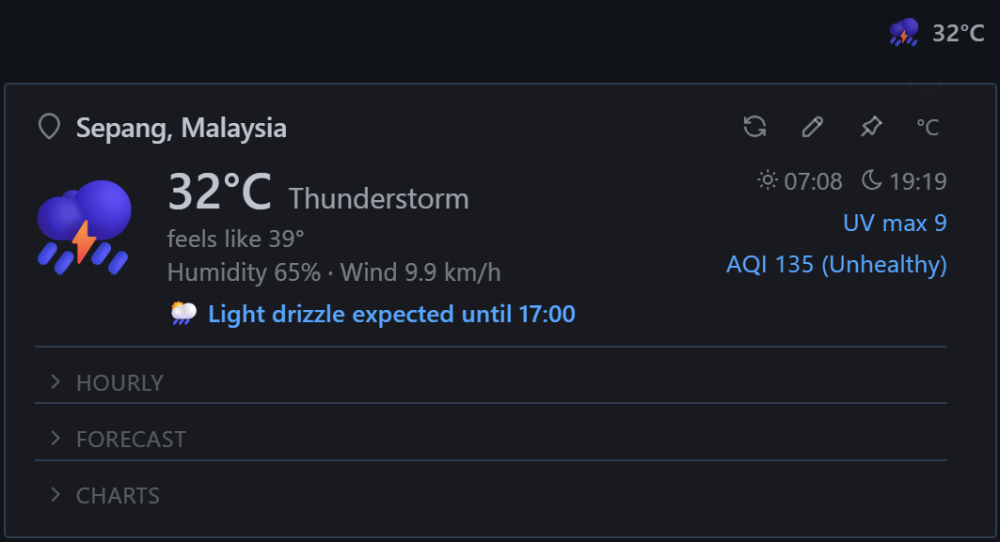
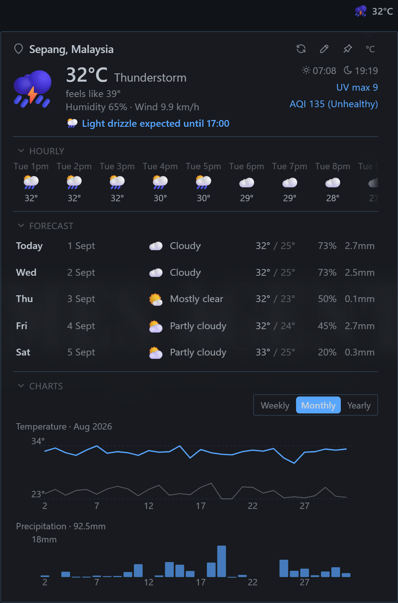
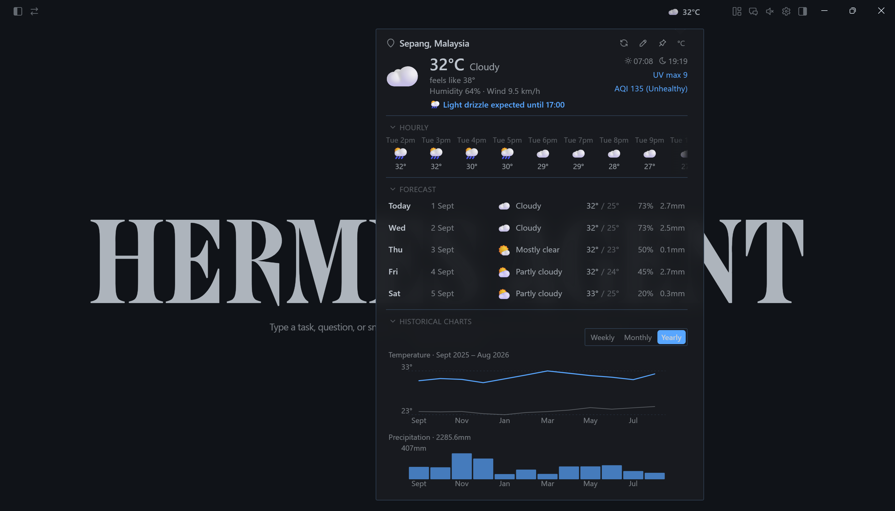

# Weather Widget for Hermes Desktop

A weather popover that lives in your titlebar. Click the temperature to see current conditions, an hourly strip you can scroll, a 5-day forecast, and temperature/precipitation historical charts, all in one panel.

  &nbsp;&nbsp;&nbsp;&nbsp;&nbsp;
  

## What it does

**Titlebar widget**: shows the current temperature and condition icon (e.g. `🌙 27°C`). Click to open the popover.

**Popover**: four collapsible sections:
- **Current**: big icon, temperature, feels-like, humidity, wind, sunrise/sunset, UV index, AQI
- **Hourly**: scrollable strip around the current hour (up to 24 hours back and 24 hours ahead), drag or wheel to scroll, starts at the current hour
- **Forecast**: 5 days with high/low, precipitation %, and mm; hover a row for exact rain windows
- **Historical charts**: temperature and precipitation over 7 days, 30 days, or 12 months; aligned x-axes, hover for exact values

**Location**: type a city or pin up to 3 saved locations for quick switching. Optional IP auto-detect is **off by default** and opt-in. When on, the widget shows an `auto · on` badge whose tooltip discloses it uses your public IP via ipwho.is, and it only calls ipwho.is with your public IP while enabled.

**Units**: °C/°F and km/h/mph toggle. Data stays metric internally; conversion is view-only.

**Theme-aware**: uses the app's CSS variables so it works in light, dark, or any theme without hardcoded colors.

## Install

1. Copy `plugin.js` to your Hermes desktop-plugins folder:
   - **Windows**: `%USERPROFILE%\.hermes\desktop-plugins\weather\plugin.js`
   - **Linux/macOS**: `~/.hermes/desktop-plugins/weather/plugin.js`

   The folder must be named `weather` and the file must be named `plugin.js` exactly.

2. Restart Hermes Desktop (or reload plugins from the settings pane).

3. The widget appears in the titlebar on the right, next to the system buttons.

## Requirements

- Hermes Desktop (Windows/macOS/Linux)
- Internet connection for weather data (Open-Meteo and ipwho.is, both free, no keys, CORS enabled)

## How it works (briefly)

- **Data**: Open-Meteo (forecast + archive + air quality) + ipwho.is (IP geolocation)
- **No historical chart libraries**: everything is hand-drawn inline SVG (disk plugins can't bundle npm deps)
- **No build step**: plain ES module, loads directly
- **Safe by default**: every API call has a timeout; null checks everywhere; a bad location never breaks the UI

## Configuration

All settings persist automatically:
- Display units (°C/°F, metric/imperial)
- Auto-location on/off (default off, opt-in, calls ipwho.is with your public IP when on)
- Saved locations (max 3, newest first)
- Section collapsed/expanded state
- Historical chart zoom level (week/month/year)
## License

MIT. Do whatever you want with it.

---

*Built for Hermes Desktop. If you find it useful, a star on the repo helps others discover it.*